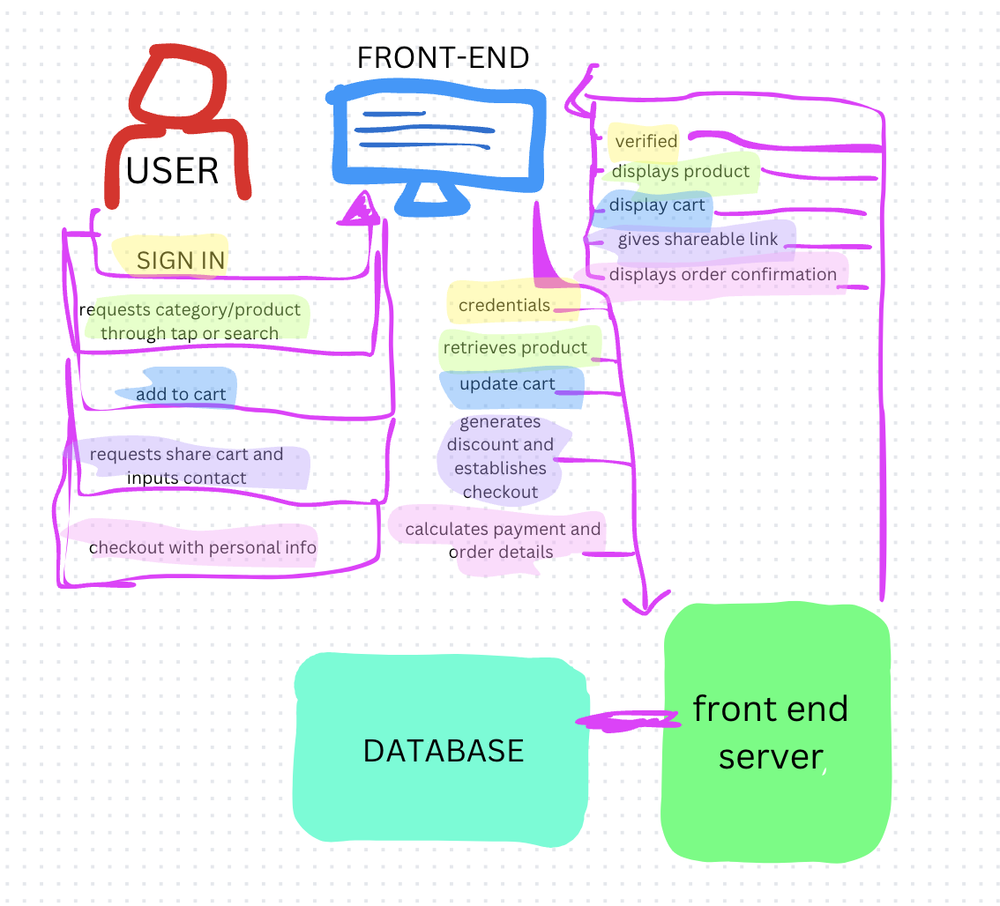

<<<<<<< HEAD
# Sophie's jewlery website: Cocojewl
### Where can you securely order stunning waterproof jewelry perfect for any occasion? At Cocojewl, you are guaranteed to find stylish and beach ready looks from rings, bracelets, necklaces, earrings, and more! The best part is, you don't have the hassle of taking off jewelry before going for a swim. Find sustainable and affordable jewelry at Cocojewl.  You can also find other accessories like tote bags and hats for your next trip to the beach. When you find the perfect products for you, feel free to add to your cart and share it with a friend! By sharing with friends you can get a 10% discount code on your purchase. Cocojewl is your new favorite jewelry boutique!

### Design of website:

### Diagram of user and backend interaction:

## Start up details:

# Key Features:
### Secure login over HTTPS.
### Browse products by categories 
### Add items to cart and view cart.
### Share cart with a friend to receive a 10% discount.
### Checkout and payment integration with third-party payment gateway (stripe)
### Real-time cart updates when shared with a friend.
### Data Storage of user data, product inventory, and purchase history.
# Technology:
## HTML:
### Structuring the main website:  login, product listing, cart, and checkout pages.
### Update the HTML page for browsing categories and checkout.
### Links between categories, products, and account pages.
## CSS:
### Styling the website.
### Using CSS for an organized layout.
### Responsive design using media queries or layouts (maybe for different device sizes).
### CSS animations for a smooth and professional experience when shopping

## JavaScript:
### Interactivity for actions like signing in, adding items to the cart, and checking out your cart.
### Handling cart updates when shared with a friend using JavaScript.
### Validation for the login form and client-side input checks.
### Manages interaction between backend server and database for cart interactions and login authentication.

## React:
### Creating constant components for product, cart view, and login display.
### React Router for navigating between pages (browse, login, and checkout).
### Use React to update cart items quickly.
### Showing user specific details (like an updated cart).

## Service (Backend):
### Building an API with endpoints for:
### User authentication (login/register).
### Fetching product data from the database.
### Adding and managing cart items.
### Processing payments through a third-party service like Stripe.
### A third-party API call to provide external services, such as fetching product recommendations or payment processing.

## Authentication:
### A secure login system where users sign in to manage their carts and check out.
### Displaying the user's name and cart contents once logged in.

## Database (MongoDB or MySQL):
### Storing user data, product details, and cart info.
### Stores user transaction and order history.
### Managing product inventories.

## WebSocket:
### Updates when a cart is shared with a friend. When a friend views or likes the cart, the user can see.

## HTML Deliverable:
### HTML pages: One for browsing products, one for the cart, and one for checkout.
### Links: Each product and category is hyperlinked.
### Text: Product details (e.g., price, description) are displayed on the product page.
### Images: Product images are loaded dynamically from the database.

## CSS Deliverable:
### Header, footer, main content: Well-organized layout across all pages.
### Diverse Layout design: The layout adjusts seamlessly for mobile, tablet, and desktop views.
### Navigation elements: Styling changes for active links, hovering effects, and transitions when moving between pages.
### Application text: Consistent fonts and colors across the website.
### Images: Sizing and styling for all product images.

## React Deliverable:
### Components: Separate components for product listings, cart management, and checkout process.
### State management: Handling cart updates in real time, using hooks like useState and useEffect.
### Routing: React Router to switch between different views (e.g., product page, cart, checkout).
### Application logic: Showing updated cart contents when a friend views the shared cart.

## Service Deliverable:
### Backend endpoints: API calls for login, cart management, and product retrieval.
### Third-party API call: Stripe integration for payment processing.
### Frontend service calls: Using fetch or Axios to communicate with the backend.

## Database/Login Deliverable:
### Database: Stores users, cart data, and purchase history.
### User registration: Allows new users to sign up and existing users to log in.
### Persistent data storage: Cart and user data persist between sessions.
### Login restrictions: Users can’t access the cart or checkout page unless authenticated.

## WebSocket Deliverable:
### Backend listens for WebSocket connections: Real-time updates for the shared cart.
### Frontend connects via WebSocket: The shared cart is updated in real-time when the friend adds or removes items.
### Data sent over WebSocket: Updates are broadcasted between users in real-time, reflecting cart changes.